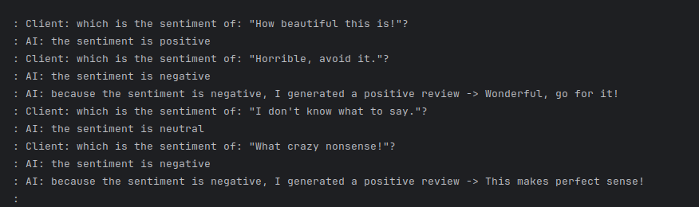

# LLAMA Sentiment Analysis POC (Java)

### Run LLAMA container

```bash
sudo docker pull ollama/ollama
sudo docker run -d -v ollama:/root/.ollama -p 11434:11434 --name ollama ollama/ollama
sudo docker exec -it ollama ollama run llama3
```

### Runt the Java application

Run the application and look at the console



